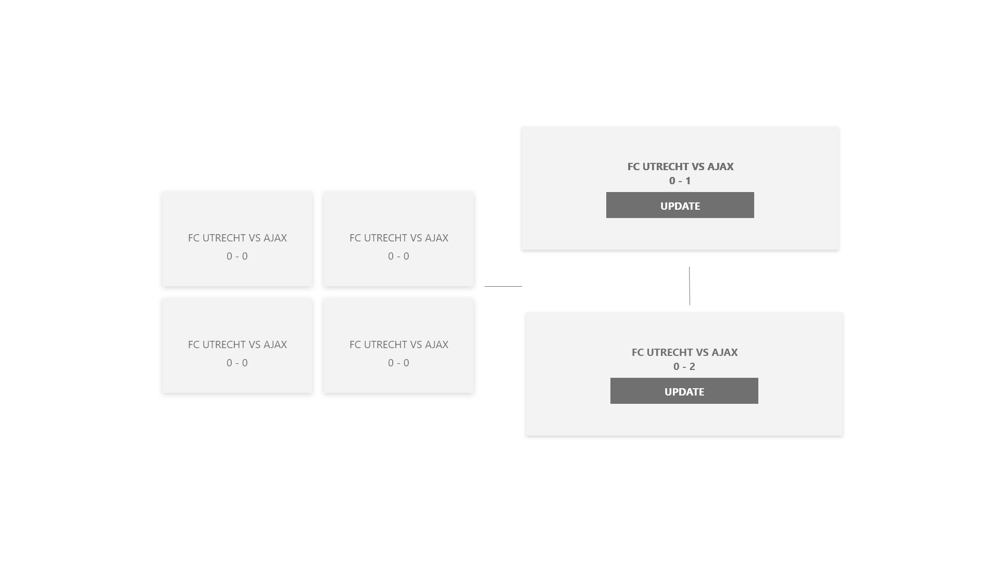

# BROWSER TECH ENDGAME

## What is PE and why does it matter..

In the ideal world of software development, we can develop for a specific CPU architecture. It will work on virtually every on devices that uses the same instruction set. 

But not in the World of Webcraft. There is no control on the how the user will use your website, when your user will use your website and under what circumstances. Heck, even the browser developers have their own wild fantasy.. XMLHttpRequest? No, internet explorer has to call their Ajax object ActiveXObject..

That is why you should develop a website where the core functionality works across all browsers under virtually every circumstance. Do you want extra functionality? Build ontop of your core functionality.

## Wireflow

## Feature

